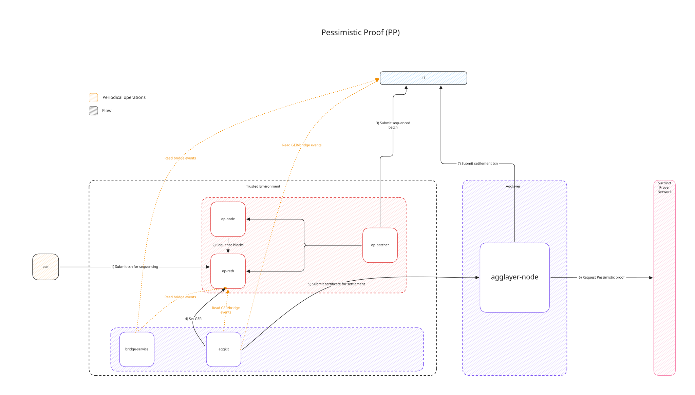
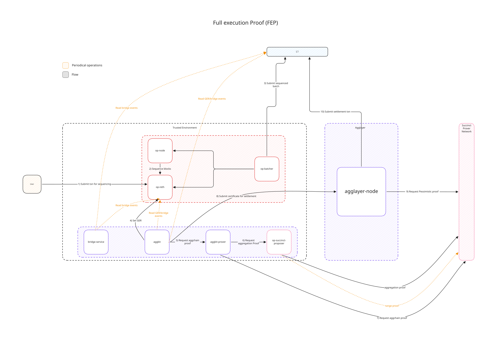

# Devnets Deployment Guide

This repository provides step-by-step instructions for deploying an OP Stack rollup and connecting it to the Agglayer.

## Overview

The diagrams below show the high-level architecture of the full setup for each supported consensus type.

### Pessimistic Proof (PP) — AggchainECDSAMultisig

Contract docs: https://agglayer.github.io/protocol-team-docs/smart-contracts/v12/AggchainECDSAMultisig/

PP is the narrow, bridge-safety proof. It doesn't attest to a chain's state transition — it only proves that withdrawal claims a chain makes against the unified bridge are backed by real deposits, so a misbehaving chain can't drain other chains' assets.

### Full Execution Proof (FEP) — AggchainFEP

Contract docs: https://agglayer.github.io/protocol-team-docs/smart-contracts/v12/AggchainFEP/

FEP is the strong proof: it cryptographically attests to the chain's full state transition using SP1 (Succinct) zero-knowledge proofs, on top of the bridge-safety guarantee the PP provides.

## Deployment Steps

Before starting, review the **[Prerequisites](00-prerequisites.md)** for component versions and the wallet accounts you'll need to fund.

1. **[Rollup Creation](01-rollup-creation.md)** - Initiate the Agglayer chain integration process with Polygon Labs to receive the deployment artifacts
2. **[Genesis Generation](02-genesis.md)** - Generate the L2 genesis file with pre-deployed contracts
3. **[OP Stack Deployment](03-op-stack.md)** - Deploy L1 contracts and merge genesis allocs using `op-deployer`
4. **[Rollup Initialization](04-rollup-initialization.md)** - Initialize the rollup on-chain with required parameters
5. **[OP Succinct Configuration](05-op-succinct-config.md)** *(FEP only)* - Add and select the op-succinct configuration for L2 output proposals
6. **[Polygon Stack Common Components](06-polygon-stack-common.md)** - Aggkit configuration for any consensus type
7. **[Polygon Stack FEP Components](07-polygon-stack-fep.md)** *(FEP only)* - Run the Aggkit Prover and OP Succinct Proposer services

