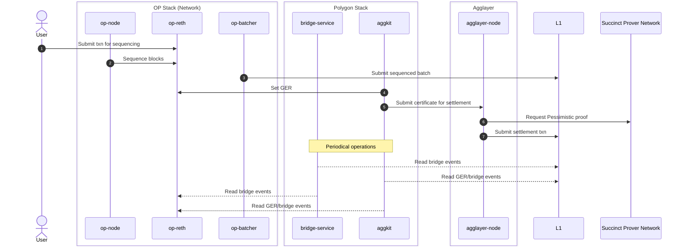
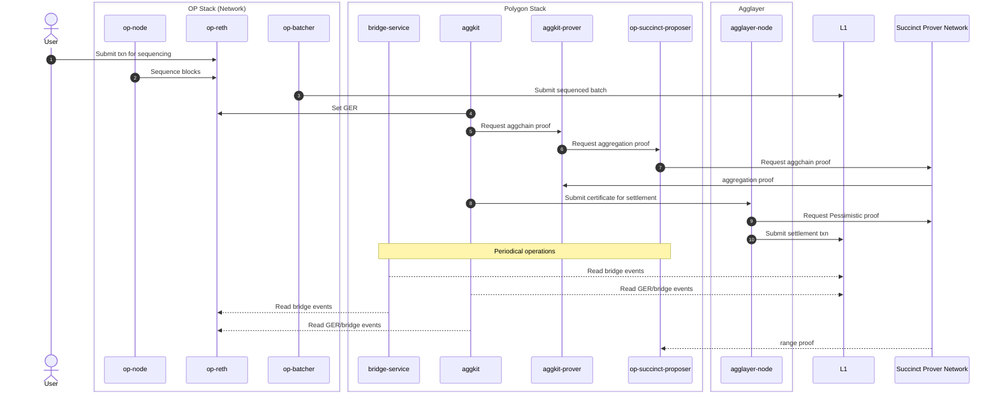

```
░█▀▀░█▀▄░█░█░░░░░█▀█░█▀█░░░░░█▀▄░█▀▀░▀█▀░█░█
░█░░░█░█░█▀▄░▄▄▄░█░█░█▀▀░▄▄▄░█▀▄░█▀▀░░█░░█▀█
░▀▀▀░▀▀░░▀░▀░░░░░▀▀▀░▀░░░░░░░▀░▀░▀▀▀░░▀░░▀░▀
```

**Deploy an OP Stack rollup, connected to Agglayer.**

This repository provides a step-by-step deployment guide for standing up an OP Stack rollup and attaching it to the [Agglayer](https://agglayer.github.io/). It is intended for chain operators bringing up devnets, testnets, or production networks on **Sepolia** or **Ethereum mainnet**.

> [!IMPORTANT]
> The commands in this guide pass private keys directly on the command line for clarity. For testnet and mainnet deployments, use a keystore or hardware wallet — never literal private keys, and never commit them to version control. See [Prerequisites](00-prerequisites.md) for guidance.

## Architecture

The diagrams below show the high-level architecture of the full setup for each supported consensus type.

### Pessimistic Proof (PP) — AggchainECDSAMultisig

Contract docs: https://agglayer.github.io/protocol-team-docs/smart-contracts/v12/AggchainECDSAMultisig/

PP is the narrow, bridge-safety proof. It doesn't attest to a chain's state transition — it only proves that withdrawal claims a chain makes against the unified bridge are backed by real deposits, so a misbehaving chain can't drain other chains' assets.



### Full Execution Proof (FEP) — AggchainFEP

Contract docs: https://agglayer.github.io/protocol-team-docs/smart-contracts/v12/AggchainFEP/

FEP is the strong proof: it cryptographically attests to the chain's full state transition using SP1 (Succinct) zero-knowledge proofs, on top of the bridge-safety guarantee the PP provides.



## Choose your path

Pick the consensus type for your rollup and follow the corresponding steps below:

| Consensus | Steps |
|---|---|
| **PP** (AggchainECDSAMultisig) | 1 → 2 → 3 → 4 → 6 |
| **FEP** (AggchainFEP)          | 1 → 2 → 3 → 4 → 5 → 6 → 7 |

## Deployment Steps

Before starting, review the **[Prerequisites](00-prerequisites.md)** for host tooling, component versions, and the wallet accounts you'll need to fund.

1. **[Rollup Creation](01-rollup-creation.md)** — Initiate the Agglayer chain integration process with Polygon Labs to receive the deployment artifacts
2. **[Genesis Generation](02-genesis.md)** — Generate the L2 genesis file with pre-deployed contracts
3. **[OP Stack Deployment](03-op-stack.md)** — Deploy L1 contracts and merge genesis allocs using `op-deployer`
4. **[Rollup Initialization](04-rollup-initialization.md)** — Initialize the rollup on-chain with required parameters
5. **[OP Succinct Configuration](05-op-succinct-config.md)** *(FEP only)* — Add and select the op-succinct configuration for L2 output proposals
6. **[Polygon Stack Common Components](06-polygon-stack-common.md)** — Aggkit configuration for any consensus type
7. **[Polygon Stack FEP Components](07-polygon-stack-fep.md)** *(FEP only)* — Run the Aggkit Prover and OP Succinct Proposer services
